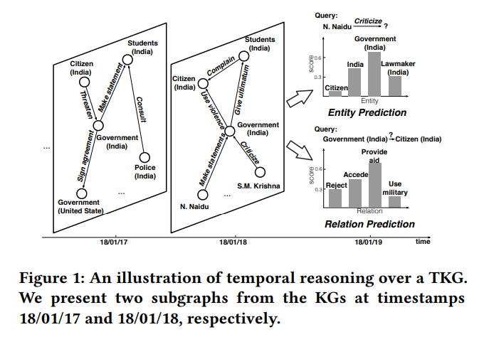

# Bilince Açılan Kapı: Öngörücü Yapay Zeka
Mazisi çocukluk yaşlarıma kadar giden ve bilim kurgu filmlerine konu edilen bilinçli makinelere olan merakım, bilim çevrelerinin henüz bir uzlaşıya varamadığı ve hala gizemini koruyan bu probleme yoğunlaşmamdaki en önemli motivasyon oldu. Neredeyse üç yıldır büyük bir çabayla üzerinde çalıştığım bu konuya bir cevap olacağı düşüncesiyle vardığım sonuçları sizinle paylaşacağım.

Öncelikle insan beyninden ve zihninden başlayacağız. Ardından yapay sinir ağlarına ve bu ağların insan beyninin sinir ağları yapısına olan benzerliğine değineceğiz. Grafik sinir ağlarının dış dünyayı nasıl modellediğini, bilinç probleminin ne olduğunu inceleyip son olarak bu probleme öngörücü yapay zeka ile yanıt bulacağız. Sözkonusu yapay zekayı, geleceği tahminlediğinden dolayı "öngörücü" olarak tanımlama ihtiyacı hissettim, bunu daha iyi tarif edecekler olacaktır elbette.

## İnsan Beyni ve Çalışma Prensibi
İnsan beyni büyük bir bilgisayar gibi çalışmaktadır. Dış dünyadan ve vücuttan aldığı bilgileri işlemekte ve vücuda mesajlar göndermektedir. Beyin dokusu yaklaşık 100 milyar sinir hücresinden (nöron) oluşmaktadır[[1](https://www.ncbi.nlm.nih.gov/books/NBK279302/)].  Beyin ve sinir sisteminin birincil işlevsel birimi bu nöron hücreleridir. Tüm duyumlar, hareketler, düşünceler, anılar ve hisler nöronlardan geçen sinyallerin sonucudur[[2](https://www.ninds.nih.gov/health-information/public-education/brain-basics/brain-basics-know-your-brain)]. Beyin aktivitesi, nöronların birbirine bağlanması ve sinir uyarılarına yanıt olarak nörotransmitter salınımı ile gerçekleşmektedir. Nöronlar, sinir yolları, sinir devreleri ve ayrıntılı ağ sistemleri oluşturmak için birbirine bağlanmaktadır. Tüm devre, nörotransmisyon süreci tarafından yönlendirilmektedir[[3](https://en.wikipedia.org/wiki/Human_brain)].

## Yapay Sinir Ağları(ANN) ve İnsan Beyni
İlk olarak 1944'te Warren McCullough ve Walter Pitts tarafından önerilen Yapay Sinir Ağları, insan beyninin işlevi ve yapısından esinlenerek tasarlanmış makine öğrenimi modelleridir. Karmaşık sorunları ele almak için iş birliği yapan birbirine bağlı düğümlerin veya nöronların oluşturduğu ağlardır[[4](https://www.techtarget.com/searchenterpriseai/definition/neural-network)]. 

Yapay Sinir Ağlarını oluşturan düğümler (yapay nöronlar) "katmanlar" halinde düzenlenmiştir. Bilgi bu düğümlerden akar ve ağ, verilerden öğrenmek için eğitim sırasında bağlantı güçlerini temsil eden "ağırlıkları" ayarlar, bu da desenleri tanımasını, tahminlerde bulunmasını, makine öğrenimi ve yapay zeka uygulamalarında çeşitli problemleri çözmesini sağlar. Tek bir katmandan, katmanlar halinde düzenlenmiş birbirine bağlı düğümlerin (nöronların) oluşturduğu çok katmanlı bir yapıya kadar değişim gösterebilmektedir[[5](https://www.analyticsvidhya.com/blog/2021/09/introduction-to-artificial-neural-networks/)]. 

Yapay sinir ağları çeşitli veri setleri üzerinde eğitilerek borsada hisse senedi fiyatlarının tahmini, hava durumu tahmini, yüz tanıma, nesne tespiti, metin sınıflandırma, zaman serisi tahmini gibi problemler çözülebilmektedir.

## Grafik Sinir Ağları(GNN)
GNN'nin en temel birimi grafiktir. Bilgisayar biliminde grafik, "düğümler (köşeler)" ve "kenarlar" şeklinde iki bileşenden oluşan bir veri yapısıdır. Bir grafik G, G = (V, E) olarak tanımlanabilir, burada V düğüm kümesidir ve E aralarındaki kenarlardır. Bir grafik, sosyal medya ağları veya moleküller gibi ilişki ağlarını temsil edebilir. Düğümler kullanıcılar, kenarlar da bağlantılar olarak düşünülebilir[[6](https://neptune.ai/blog/graph-neural-network-and-some-of-gnn-applications)].

Grafik Sinir Ağları (GNN), grafiklerle tanımlanan veriler üzerinde çıkarım yapmak üzere tasarlanmış bir derin öğrenme yöntemleri türüdür. GNN'ler (Graf Sinir Ağları), grafik yapılarını girdi olarak kullanarak çalışan ve bu grafiklerden veri çıkarımı yaparak sonuçlar üreten makine öğrenimi (ML) sistemleridir[[7](https://seon.io/resources/dictionary/graph-neural-network-gnn/)]. Grafiklerdeki kenar elemanları matematiksel olarak ifade edilir; böylece makine öğrenimi algoritmaları düğüm, kenar veya grafik düzeyinde tahminler yapabilmektedir. Yakın zamanda yayınlanan bir makalede[[8](https://arxiv.org/pdf/2108.11482)], GNN'lerin varış süresi tahminlerini iyileştirmek için ulaşım haritalarını grafik olarak nasıl kullandığı anlatılmıştır[[9](https://blogs.nvidia.com/blog/what-are-graph-neural-networks/)].

## Bilinç Problemi
Bilinci "kolay problem" ve "zor problem" olarak ikiye ayıran David Chalmers'ın tanımına göre bilinç, "kırmızıyı görmenin, sarımsağın kokusunu almanın ya da Beethoven'ı duymanın insana nasıl hissettirdiğiyle ilgili içsel ve öznel bir deneyim"dir. Bir diğer adıyla fenomenal bilinç dediğimiz bu tür deneyimler, kişiye özel ve öznel olduğundan "qualia" olarak da adlandırılır. "Qualia", bireyin bilinçli deneyimlerinin doğrudan ve açıklanamaz yönleridir; yani, sadece deneyimi yaşayan kişinin bilebileceği ve tanımlayabileceği şeylerdir.

### İnsan Bilincini Açıklamaya Yönelik Teoriler
Yukarıda değindiğimiz gibi David Chalmers, bilinç problemini iki kategoriye ayırmıştır: Kolay Problem ve Zor Problem. Chalmers için kolay problem, bilişsel işlevleri açıklamada ilerleme kaydetmek ve bunların beyindeki fiziksel süreçlerden nasıl ortaya çıktığını keşfetmektir. Zor problem ise bu işlevlerin neden bilinçli deneyimle birlikte olduğunu açıklamaktır[[10](https://www.jstor.org/stable/43853850)]. (Bilişsel) kolay problem ile (fenomenal) zor problem arasındaki temel fark, ilkinin zihin felsefesindeki baskın strateji olan fizikalizm yoluyla en azından teorik olarak cevaplanabilir olmasıdır. Chalmers, nesnelden öznele doğru bir "açıklayıcı boşluk" olduğunu savunur ve zihinsel deneyimin fizikçi açıklamalarını eleştirerek onu bir düalist yapar. Chalmers, görüşünü "doğalcı düalizm" olarak nitelendirmektedir[[11](https://en.wikipedia.org/wiki/David_Chalmers)].

Entegre Bilgi Teorisi (IIT), son 10-20 yılda daha çok nörobilimci Giulio Tononi tarafından geliştirilen, yaygın olarak tartışılan ve bazıları tarafından güçlü bir şekilde desteklenen bir "matematiksel bilinç teorisi"dir. Teori, tek hücreli organizmalardan belki de tüm ekosistemlere kadar beyinlerdeki ve diğer sistemlerdeki "entegre bilgi" miktarını temsil eden Φ (phi) adı verilen tek bir nicel ölçü önermektedir. Bir sistem birçok modülden oluşuyorsa, tüm sistemin "entegre bilgisi", tüm modüllerinde kilitli olan bilginin toplamı olan "yerel" bilgiden farklıdır. Bu tür sistemlerin, yalnızca ve yalnızca yeterince büyük bir Φ'ye sahiplerse anlamlı bir şekilde bilinçli oldukları varsayılır. Bir sistemin entegre bilgi değeri ne kadar büyükse, o kadar bilinçli olduğu kabul edilir[[12](https://www.psychologytoday.com/us/blog/finding-purpose/202310/an-intriguing-and-controversial-theory-of-consciousness-iit)].

Küresel çalışma alanı teorisi (GWT), bilişsel bilimciler Bernard Baars ve Stan Franklin tarafından 1980'lerin sonlarında önerilen bilinçle ilgili bir çerçevedir. Bilinçli ve bilinçsiz süreçlerin eşleştirilmiş büyük bir çiftini nitel olarak açıklamak için geliştirilmiştir. GWT, bilinci ve üst düzey bilişi, yaygın, paralel sinirsel süreçler boyunca "rekabet" ve "entegre bilgi akışları"ndan ortaya çıkan bir şey olarak modellemede etkili olmuştur. GWT, zihni bir tiyatroya benzetir; bilinçli düşünce, ana sahnede aydınlatılan malzeme gibidir. Beyin, çoğu bilinçsiz olan, paralel olarak çalışan birçok özel süreç veya modül içerir. Dikkat, bir spot ışığı görevi görür ve bu bilinçsiz aktivitenin bir kısmını küresel çalışma alanında bilinçli farkındalığa getirir. Küresel çalışma alanı, bilgilerin modüller arasında yayılmasına izin veren işlevsel bir yayın ve entegrasyon merkezidir. Bu nedenle, işlevsel bir bilinç teorisi olarak sınıflandırılmaktadır[[13](https://en.wikipedia.org/wiki/Global_workspace_theory)].

Michio Kaku, bilinci "Uzay-Zaman Teorisi"(Space-Time Theory) adını verdiği teoriyle açıklamaktadır. Michio Kaku'ya göre bilinç, çeşitli parametrelerde (örneğin sıcaklık, uzay, zaman ve diğerlerine göre) çoklu geri bildirim döngüleri kullanarak bir dünya modeli oluşturma sürecidir ve bir hedefe ulaşmak (örneğin eş, yiyecek, barınak bulmak) için kullanılır. Bilinci 4 seviyede ele almaktadır: 
+ En düşük bilinç seviyesi, bir organizmanın hareketsiz olduğu veya sınırlı hareket kabiliyetine sahip olduğu ve birkaç parametrede (örneğin sıcaklık) geri bildirim döngüleri kullanarak bulunduğu yerin bir modelini oluşturduğu Seviye 0'dır. Örneğin, en basit bilinç seviyesi bir termostattır. Herhangi bir yardım almadan, bir odadaki sıcaklığı ayarlamak için otomatik olarak bir klimayı veya ısıtıcıyı açar. Her geri bildirim döngüsü "bir bilinç birimi"ni ifade eder. Bu nedenle bir termostat tek bir seviye olan "Seviye 0" bilinç birimine sahip olur. Nem, sıcaklık vb. parametrelere göre ortama adapte olan bitkiler de "Seviye 0" bilincine sahiptir.
+ Hareketli ve merkezi sinir sistemine sahip organizmalar, "değişen konumlarını ölçmek için" yeni bir parametre seti içeren "Seviye I" bilincine sahiptir. "Seviye I" bilincine bir örnek sürüngenler olabilir. O kadar çok geri bildirim döngüsüne sahiptirler ki bunları idare etmek için merkezi bir sinir sistemi geliştirmişlerdir. Sürüngen beyninin belki de yüz veya daha fazla geri bildirim döngüsü olabilmektedir (koku, denge, dokunma, ses, görme, kan basıncı vb. duyularını yönetir ve bunların her biri daha fazla geri bildirim döngüsü içerir).
+ "Seviye II" bilincinde organizmalar sadece mekansal olarak değil, aynı zamanda başkalarına göre de yerlerinin bir modelini oluştururlar (yani, duyguları olan sosyal canlı türüdür). Seviye II bilinci için geri bildirim döngülerinin sayısı üssel olarak artar. Müttefikler oluşturmak, düşmanları tespit etmek, alfa erkeğe hizmet etmek, vb.
+ **İnsanlar, canlılar aleminde yarın kavramını anlamada tektir.** Hayvanların aksine, kendimize sürekli olarak "Ya şöyle olsaydı?" diye sorarız; haftalar, aylar ve hatta yıllar sonra, bu yüzden Michio Kaku, "Seviye III" bilincinin dünyadaki yerinin bir modelini oluşturduğuna ve sonra kaba tahminlerde bulunarak bunu geleceğe simüle ettiğine inanmaktadır. Bunu şu şekilde özetleyebiliriz: İnsan bilinci, dünyanın bir modelini oluşturan ve sonra geçmişi değerlendirerek geleceği simüle ederek bunu zaman içinde simüle eden belirli bir bilinç biçimidir. Bu, bir hedefe ulaşmak için karar vermek amacıyla birçok geri bildirim döngüsüne arabuluculuk etmeyi ve bunları değerlendirmeyi gerektirir[[14](https://bookstore.dr.com.tr/urun/future-of-the-mind/7011093)].

Michio Kaku beyinde bilgi akış hiyerarşisini yöneten en üst birimi bir kurumun yöneticisine benzeterek "CEO" şeklinde adlandırmaktadır. Seviye III bilince ulaşıldığında, geleceği simüle etmek ve nihai bir karar vermek için bir CEO'nun çok sayıda geri bildirim döngüsünü gözden geçirmesine ihtiyaç duyulmaktadır.

Bu araştırma, Michio Kaku'nun teorisi üzerinden yürütüldü. Bunun en önemli sebebi, bilinç bağlamında insanları diğer canlılardan ayıran en önemli özelliğin geleceği simüle edebilmesi olduğunu tespit etmesi ve bilinç konusunu dış dünyayı modelleme açısından değerlendirmesidir. Bu yaklaşımın insan bilincini net bir şekilde ayırt etmesi, bilinçle ilgili soruların yanıtlanmasında bizim için gerçekçi bir neden ortaya koymaktadır.

Bu araştırmada qualia ile ilgili herhangi bir çalışmaya yer verilmemiştir. İlgilenenler için bu konuyu matematiksel yöntemlerle ele alan  [bu ve bunun gibi makaleleri](https://arxiv.org/pdf/2306.00239) önermekteyim.

## Yapay Zeka ve Bilinç Problemi
Bilinç problemine yaklaşımımızda Michio Kaku'nun teorisi üzerinden gideceğiimiz için üzerinde araştırma yapacağımız çalışmaları "geleceği tahminleme" temasına göre seçeceğiz.

### MIT'nin büyük dil modeli araştırması
Konumuz yapay zeka olduğu için GPT-2 Büyük Dil Modeliyle ilgili bir araştırmaya odaklanalım. MIT(Massachusetts Institute of Technology)'de 2021 yılında yayımlanan bir [makalede](https://www.pnas.org/doi/10.1073/pnas.2105646118) insan beyni ve yapay sinir ağları benzerliği konusunu irdeleniyor. Çalışmada; örneğin, arkadaşlarınızla sohbet esnasında konuşurken karşınızdaki kişinin bir sonraki söyleyeceğiniz sözü tahmin etmesi ve bir sonraki kelimeyi tahmin etme esasına göre çalışan dil modelleri arasında benzerlik tespit edilmektedir. Beynin bilişsel üst düzey görevlerinin nasıl işlediğini gösterdiği çalışmada, makine öğrenimi algoritmaları beyin verileriyle eşleştirilmekte ve insan beyninin dil ile ilgili işlevlerinde bu modellere benzer şekilde tepki verdiği görülmektedir. Bu çalışmanın bulgularına göre, insan beyninin bir yapay sinir ağı modeline çok benzer bir şekilde işlediği anlaşılmaktadır.

Bu çalışma, yapay zeka ve bilinç ilişkisini keşfedeceğimiz bir yolda bize bir başlangıç noktası sunuyor.  GPT ve benzeri büyük dil modelleri, dili kelimelerin bağlamsal ve konumsal bilgisiyle işleyen transformer tabanlı modellerdir. Bu dil modelleri metinleri zamansal boyutuyla ele almamaktadırlar(GPT'nin eski sürümlerinde). O halde bu çalışma için şunu söyleyebiliriz: 1) İnsanın dil anlayışını modelliyor, 2) Dilde bağlamsal ve konumsal tahminleme yapıyor.

Bizim amacımız, aradığımız yapay zekanın 1) Dış dünyayı modellemesi, 2) Olgu ve gerçeklerden zamansal tahminleme yapması.

### Çin Bilim Akademisi Üniversitesi'nin Zamansal Bilgi Grafiği Öğrenmesi çalışması
Yoğun araştırmalarım sonucunda bu iki koşulu sağlayan bir yapay zeka modeliyle karşılaştım. Zixuan Li'nin başını çektiği "Temporal Knowledge Graph Reasoning Based on Evolutional Representation Learning" [[15](https://arxiv.org/pdf/2104.10353)] adlı çalışma bu iki koşulu da sağladığını farkettim. Şimdi bu modeli detaylıca inceleyelim ve gereksinimlerimizi sağlayıp sağlamadığına karar verelim.

#### Hangi yapay sinir ağı modellerini kullanıyor?
Çalışmanın [kaynak koduna](https://github.com/Lee-zix/RE-GCN) baktığımızda RGCN ve GRU gibi yazılım teknolojileri kullandığını görmekteyiz. GNN'ler hem homojen hem de heterojen olabilmektedir. Homojen GNN'ler tek çeşit kenar ve bağlantıları temsil ettiğinden ihtiyacımızı karşılamamaktadır. Tüm olgu ve gerçekleri temsil edebilmesi için bir heterograf çeşidi olan RGCN(Relational Graph Convolutional Network) teknolojisi en uygun seçimdir. Örnek vermek gerekirse bir sosyal ağda sadece "kullanıcı" düğümleri ve "arkadaşlık" bağlantıları bulunmaktadır. Dolayısıyla bu tür grafik modelleri için homojen GNN'ler kullanılabilir. Heterojen grafik modelleri, birden çok düğüm ve bağlantı çeşidi içerdiğinden tüm olgu ve gerçekler için tam bir modelleme yapılabilmesini sağlayabilir.

GRU (Gated Recurrent Unit), LSTM (Long Short-Term Memory) ve daha birçok alternatifleri gibi gelişmiş geri beslemeli sinir ağı (RNN) hücresi türüdür. Zaman serisi verileri ve sıralı veriler üzerinde çalışan modellerin uzun vadeli bağımlılıkları öğrenmesine yardımcı olmaktadır. Zaman serisi tahmininin amacı, geçmiş verilere dayalı bir model oluşturmak ve bunu gelecekteki gözlemleri tahmin etmek için kullanmaktır[[16](https://towardsdatascience.com/predictive-analytics-time-series-forecasting-with-gru-and-bilstm-in-tensorflow-87588c852915)]. Geleceğe yönelik satış tahmini, ekonomik tredler, hava durumu tahmini, astronomide yıldızların mesafelerini tahmin etmek için kullanılan, konumları değişkenlik gösteren yıldızların keşfedilmesi gibi uygulamalarda bir modelleme aracı olarak kullanılmaktadırlar.

#### Nasıl bir model sunuyor?
Çalışmanın  makalesinin özetinde model hakkında şu ifadelere yer veriliyor: *"Gelecekteki olguları tahmin etmenin yolu, tarihsel olguları iyice anlamaktır. Bir TKG(Temporal Knowledge Graph) aslında farklı zaman damgalarına karşılık gelen bir KG(Knowledge Graph) dizisidir, burada her KG'deki tüm eşzamanlı olgular yapısal bağımlılıklar sergiler ve zamansal olarak bitişik olgular bilgi sağlayan ardışık desenler taşır. Bu özellikleri etkili ve verimli bir şekilde yakalamak için, KG dizisini yinelemeli olarak modelleyerek her zaman damgasındaki varlıkların ve ilişkilerin evrimsel temsillerini öğrenen RE-GCN adlı Grafik Evrişim Ağı'na (GCN) dayalı yeni bir Yinelemeli Evrim Ağı öneriyoruz."*

Netleştirecek olursak;
+ Her zaman damgasında(eş zamanda) bilgi grafiğinde  birbirine yapısal olarak bağlı olgular yer almaktadır. 
+ Zamansal olarak ardışık olgular belirli desenler taşımaktadırlar. 
+ Her bir zaman damgasındaki bilgi grafiği dizisi yinelemeli olarak modellenmektedir. 
+ Tasarlanan Yinelemeli Evrim Ağı ile varlıkların ve ilşkilerin evrimsel temsilleri öğrenilmektedir.

Modelde zamansal akıl yürütme görevleri iki ayrı alt göreve ayrılmaktadır:
1. **Varlık Tahmini**: Belirli bir gelecekteki zaman damgasında hangi varlığın belirli bir varlıkla birlikte belirli bir ilişkiye sahip olacağını tahmin edin (örn. N.Naidu 18/01/19'da kimi eleştirecek?);
2. **İlişki Tahmini**: Belirli bir gelecekteki zaman damgasında iki belirli varlık arasında meydana gelecek ilişkiyi tahmin edin (örneğin, 18/01/19'da Hükümet (Hindistan) ve vatandaş (Hindistan) arasında ne olacak?).

Gelecekteki olayları doğru bir şekilde tahmin edebilmek için, model geçmiş verilere derinlemesine bakmaktadır. Her zaman diliminde, varlıklar birbirlerini mevcut veriler aracılığıyla etkilemekte ve bu veriler bir Bilgi Grafiği (KG) oluşturmaktadır; bu graf ise karmaşık yapısal bağımlılıkları sergilemektedir. Örneğin, Şekil 1'de gösterildiği gibi, 18/01/18 tarihindeki veriler, Hindistan Hükümeti'nin birçok kişi tarafından baskı altında olduğunu göstermektedir; bu durum, Hindistan Hükümeti'nin 18/01/19 tarihindeki davranışlarını etkileyebilir. Ayrıca, zamansal olarak ardışık verilerde yer alan her varlığın davranışları, bilgi taşıyan ardışık desenler içerebilmektedir. Şekil 1'de görüldüğü gibi, N. Naidu'nun geçmişteki davranışları onun tercihlerini yansıtır ve bu tercihlerin gelecekteki davranışları üzerinde belirli bir etkiye sahip olabilir. Bu iki tür tarihsel bilginin birleşimi, varlıkların ve ilişkilerin davranışsal eğilimlerini ve tercihlerinin yönünü belirlemektedir.

Çalışmayı sezgisel olarak incelediğimizde, aslında standart bilgi grafiklerinin yapıtaşlarını oluşturan Head-Relation-Tail(Başlık-İlişki-Kuyruk) üçlü yapıya zaman boyutu eklendiğini görüyoruz(H-R-T-Time) ve bu veri yapısı üzerinden akıl yürütülerek gelecekteki olaylar tahminlenmektedir.

## Sonuç
Yapay sinir ağı modelleri, sınıflandırma, doğal dil işleme, karar verme gibi birçok işlevi yerine getirebilmektedir. Bu teknolojiler yapısal bilgi sağlayan bilgi grafikleriyle bütünleştirildiğinde, bu modellerin daha doğru, tutarlı ve zengin bilgi sağlaması mümkün olabilmektedir. Teknoloji dünyasında henüz tam olarak yaygınlaşmayan grafik sinir ağları ise bize yeni ve özgün eserlerin kapısını aralayacaktır.

Bu araştırmamızda, bilinçli bir yapay zekanın meydana gelmesi için gerekli olan şartları açıklığa kavuşturduk. Türü ne olursa olsun bu şartları sağlayan bir modeli "bilinçli" olarak nitelendirebilmekteyiz. 

Bu yolculuğumda bana destek olan ve katkıda bulunan başta önceki Genel Müdürüm Sayın Dr. Cebrail TAŞKIN Bey'e, şimdiki Genel Müdürüm Sayın Dr. Mert ÖZARAR Bey'e, Sayın Daire Başkanım Zeynep Nida ÖZDEMİR Hanım'a, Koordinatörüm Sayın Özgül YEĞİN MÜLAZİOĞLU Hanım'a, ismini burada tek tek sayamasam da bana destek olan tüm değerli kişilere ve hayat yolculuğumda hep yanımda olan, her zaman başarılarımı onurlandıran sevgili eşime en içten teşekkürlerimi sunarım. 

Düşüncem odur ki, doğaya ve eşyaya artık daha farklı bakacağız. Hayatın nefesini daha yakından hissedecek ve anlamını daha derinden idrak edeceğiz.

Herkese Saygılarımla
